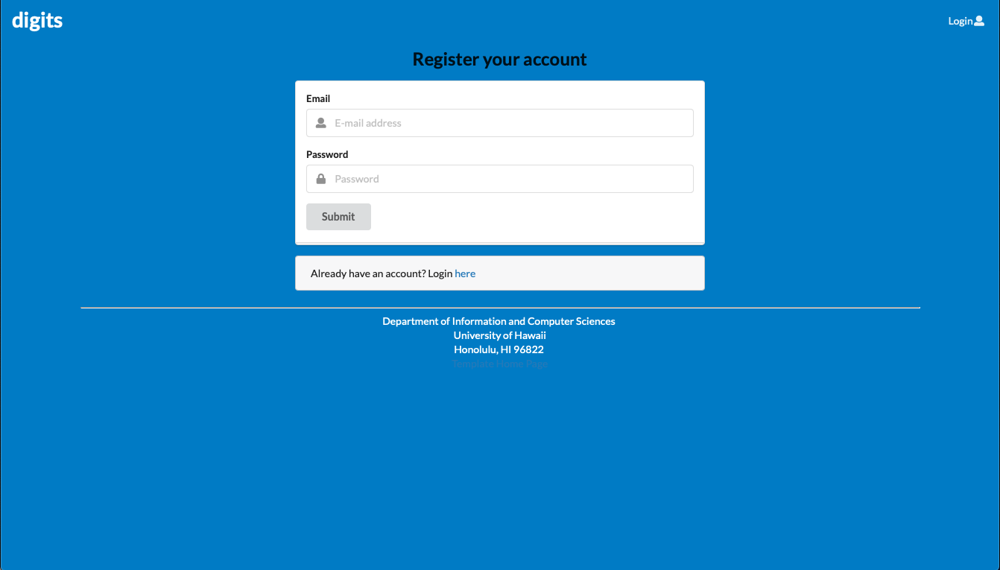
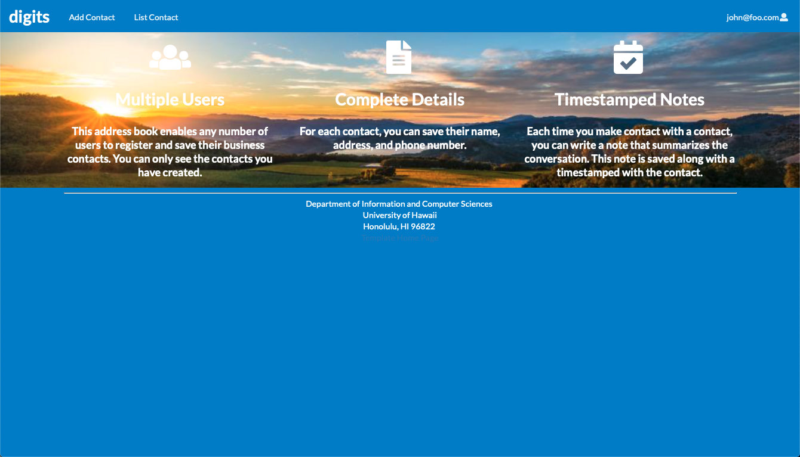
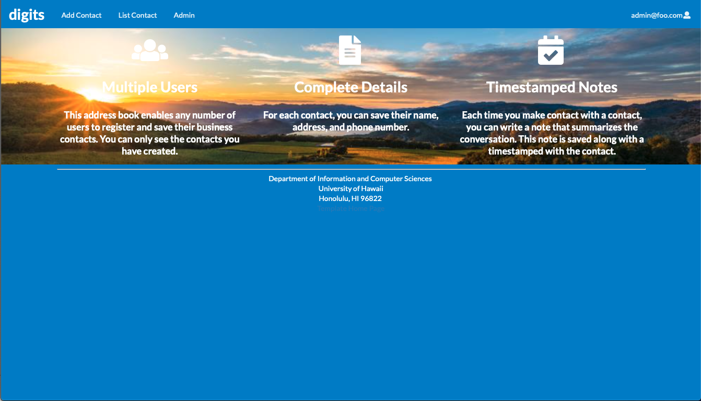
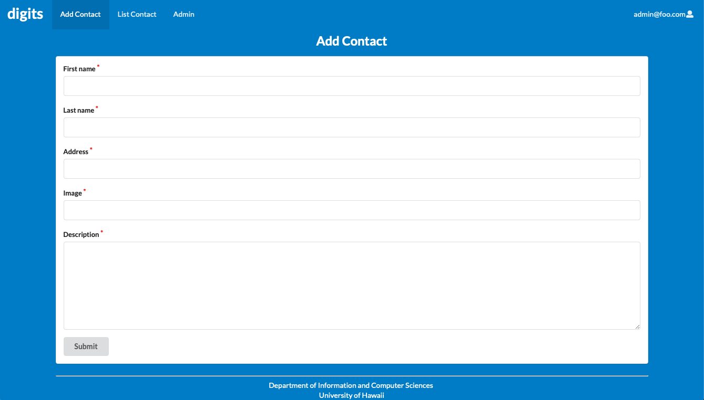
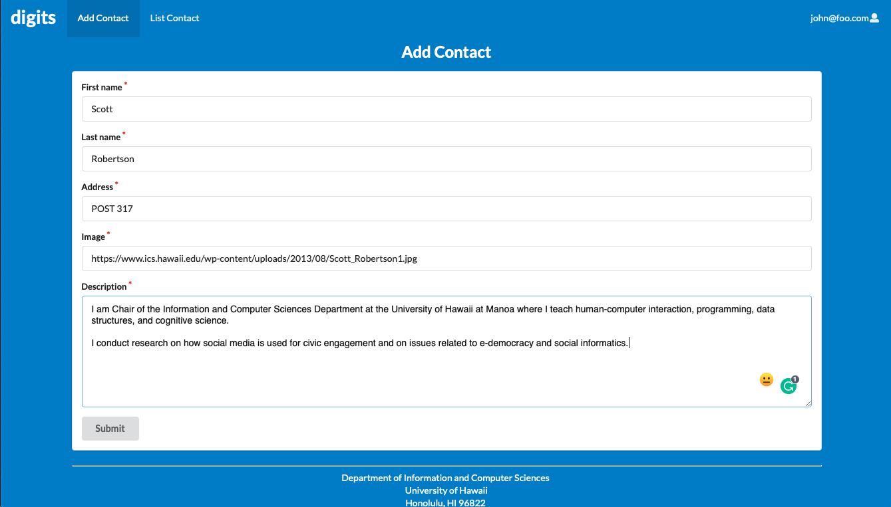
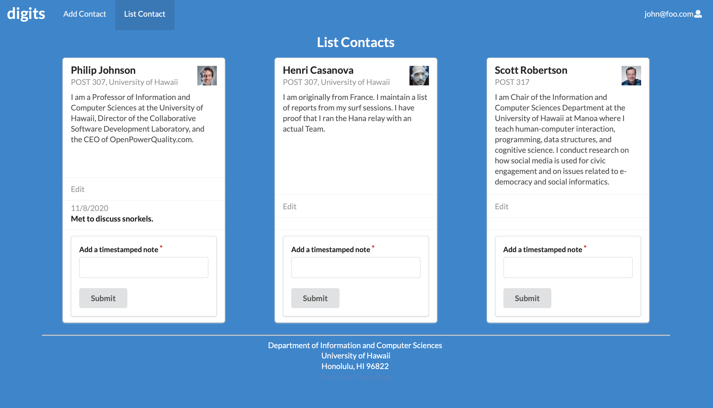

## digits


This is the first landing page that appears when you first open the site. Before signing up or logging in, the user has no privileges.

Digits is an application that offers users to:

  * Provides the ability to add and edit contacts
  * Provides a systematic function to the user with the added list in the form of a card
  * Provides a note that can leave a memo on the added list

Users are required to do a simple installation first in order to use this application.

## Installation

First, [install Meteor](https://www.meteor.com/install).

When the installation is complete, we need to download the [digits](https://github.com/yejihan92/digits) repository, turn on the terminal and run some commands.

```
$ cd app
```

```
$ meteor npm install
```

## Running the system

When meteor npm is installed, run the application after entering the following command. 

```
$ meteor npm run start
```

```
meteor npm run start

> meteor-application-template-react@ start /Users/philipjohnson/github/ics-software-engineering/meteor-application-template-react/app
> meteor --no-release-check --settings ../config/settings.development.json

[[[[[ ~/github/ics-software-engineering/meteor-application-template-react/app ]]]]]

=> Started proxy.
=> Started MongoDB.
I20180227-13:33:02.716(-10)? Creating the default user(s)
I20180227-13:33:02.742(-10)?   Creating user admin@foo.com.
I20180227-13:33:02.743(-10)?   Creating user john@foo.com.
I20180227-13:33:02.743(-10)? Creating default data.
I20180227-13:33:02.743(-10)?   Adding: Basket (john@foo.com)
I20180227-13:33:02.743(-10)?   Adding: Bicycle (john@foo.com)
I20180227-13:33:02.743(-10)?   Adding: Banana (admin@foo.com)
I20180227-13:33:02.744(-10)?   Adding: Boogie Board (admin@foo.com)
=> Started your app.

=> App running at: http://localhost:3000/
```

Now you are ready to use all the features of digits.

### Landing Page

Go to [http://localhost:3000/](http://localhost:3000/).
The first time we run the application, the screen presented to us looks like this:


### Register 

When using the Digits application for the first time, a simple sign-up process is required.



Please enter your email address and password as shown in the screenshot above.

### Homepage

After signing up, we will see the following screen.



You can now use all the features of the digits application.



Admin screen

### Add Contacts





### List Contacts

The list of screens that have successfully completed additional work is provided as follows.



Now users can add notes to their contacts or edit any information when information changes.


